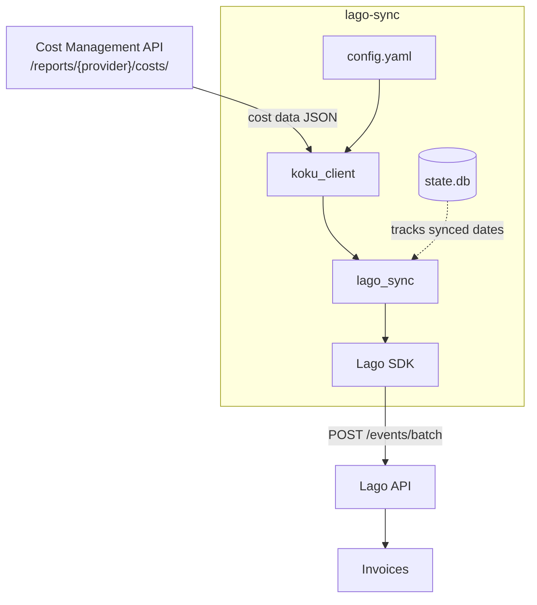

# Lago ↔ Cost Management Integration

Syncs cost data from **Red Hat Cost Management** (Project Koku) to **Lago** for generating itemized invoices. Designed for service providers that bill multiple customers for shared cloud and OpenShift infrastructure.

## Architecture



---

## Quick Start

### 1. Install

```bash
git clone https://github.com/pgarciaq/lago-integration-sample.git
cd lago-integration-sample
pip install -e ".[dev]"
```

### 2. Configure

```bash
cp config.example.yaml config.yaml
# Edit config.yaml with your credentials and customer definitions
```

### 3. Bootstrap Lago

Creates billable metrics, plan, charges, customers, and subscriptions in Lago:

```bash
lago-sync bootstrap
```

To update existing charges when configuration changes (e.g., `invoice_group_by` was modified):

```bash
lago-sync bootstrap --update
```

> **Warning:** `--update` deletes and recreates charges on the Lago plan. This is safe
> before the first billing cycle but may affect in-flight subscriptions. Use with caution
> on production systems.

### 4. Sync cost data

```bash
# Sync a specific month (most common)
lago-sync sync --month 2024-01

# Sync yesterday (default behavior for daily cron jobs)
lago-sync sync

# Preview what would be sent without pushing (USE THIS FIRST)
lago-sync sync --month 2024-01 --dry-run

# Force re-sync of previously synced data (idempotent — same transaction IDs)
lago-sync sync --month 2024-01 --force

# Force resend with NEW transaction IDs (CAUTION: creates duplicate charges!)
lago-sync sync --month 2024-01 --force-resend
```

#### `--force` vs `--force-resend`

| Flag | Bypasses local state? | New transaction IDs? | Safe to re-run? | Use case |
|------|----------------------|---------------------|-----------------|----------|
| (neither) | No | No | Yes | Normal daily sync |
| `--force` | Yes | No | Yes | Re-sync after local state DB was lost or reset |
| `--force-resend` | Yes | Yes | **NO** — creates duplicates | After recreating subscriptions or resetting billing periods in Lago |

**When to use `--force-resend`**: Only after you've deleted/recreated a subscription in Lago (which clears its event history), or after manually voiding invoices and needing to re-push all data with fresh IDs. It appends a timestamp suffix to all transaction IDs, making them unique.

### 5. Validate (run before first sync)

Check that both APIs are reachable, credentials work, and Lago entities exist:

```bash
lago-sync validate
```

### 6. Reconcile

Compare Cost Management totals against Lago's recorded usage:

```bash
lago-sync reconcile --month 2024-01
```

---

## How It Works: End-to-End Data Flow

Understanding the **full lifecycle** is essential for troubleshooting.

### Phase 1: Cost Management processes cloud bills

Before this integration can do anything, Cost Management must have **processed and summarized** data for the target period:

1. Cloud provider sends billing data (AWS CUR, Azure export, GCP BigQuery)
2. Or: OpenShift cluster operator uploads usage reports
3. Koku (Cost Management backend) downloads, converts to Parquet, runs through Trino/PostgreSQL summarization pipeline
4. Summarized data becomes available via the REST API

**Data freshness by provider:**

| Provider | Update frequency | Typical sync strategy |
|----------|-----------------|----------------------|
| OpenShift | Every 1 hour (operator upload cycle) | Can sync same-day data |
| AWS | Once per day (CUR refresh) | Sync T-1 (yesterday) |
| Azure | Once per day (export refresh) | Sync T-1 (yesterday) |
| GCP | Once per day (BigQuery export) | Sync T-1 (yesterday) |

Cost Management processes data immediately upon receipt. The limiting factor is how often each data source publishes new data. End-of-month cloud data may continue updating for 1-2 days as hyperscalers finalize bills (Reserved Instance adjustments, Savings Plan true-ups).

### Phase 2: lago-sync fetches and routes

1. `lago-sync` calls the Cost Management report API with daily resolution
2. The API returns a nested JSON tree grouped by dimensions (account, service, cluster, project, etc.)
3. `lago-sync` walks the tree, and for each leaf cost item:
   - Checks which customer's resource filters match the item's dimensions
   - Generates a Lago `Event` with a deterministic `transaction_id`
   - Multiple customers can match the same item (shared resources)
   - Items matching **no** customer are logged as warnings

### Phase 3: Lago processes events into invoices

After events are pushed to Lago:

1. Events accumulate in the current **billing period** (monthly, aligned to calendar)
2. At month-end (or manually), Lago **finalizes** the billing period
3. A **draft invoice** is generated per customer containing line items from the billable metrics
4. The invoice can be reviewed, then **finalized** to send to the customer
5. Lago can generate PDF invoices, send emails, and track payment

**The integration handles Phase 2 only.** Phase 1 is Cost Management's responsibility, Phase 3 is Lago's.

---

## Configuration Reference

### `config.yaml` structure

```yaml
# ─── Lago connection ───────────────────────────────────────────────
lago:
  api_url: "http://localhost:3000"      # Lago API base URL
  api_key: "${LAGO_API_KEY}"            # API key (Settings → Developers → API Keys)

# ─── Cost Management connection ────────────────────────────────────
cost_management:
  base_url: "https://console.redhat.com/api/cost-management/v1"
  org_id: "my-org"                      # Unique org identifier for state tracking

  # Authentication (choose one — at least one is required):
  # Option A: OAuth2 service account (for SaaS / console.redhat.com)
  client_id: "${COSTMGMT_CLIENT_ID}"
  client_secret: "${COSTMGMT_CLIENT_SECRET}"
  token_url: "https://sso.redhat.com/auth/realms/redhat-external/protocol/openid-connect/token"
  # Option B: x-rh-identity header (for local development)
  identity: "${KOKU_IDENTITY:}"         # base64-encoded x-rh-identity header

# ─── Sync behavior ────────────────────────────────────────────────
sync:
  ocp_include_overhead: true            # Include distributed platform/worker costs

  # Controls what appears as separate line items on the Lago invoice.
  # Each unique combination of these properties becomes one fee (line item).
  invoice_group_by:
    aws: ["account", "service"]         # One line per AWS account + service
    azure: ["subscription_guid", "service_name"]
    gcp: ["account", "service"]
    openshift: ["project", "cluster"]   # One line per namespace + cluster

# ─── Customer definitions ──────────────────────────────────────────
customers:
  - external_id: "customer_acme"        # Becomes the Lago customer ID
    name: "Acme Corp"                   # Display name on invoices
    currency: "USD"                     # ISO 4217 currency code
    subscription_at: "2026-01-01T00:00:00Z"  # When billing starts (events before this are ignored!)
    resources:                          # What this customer is billed for:
      - provider: aws
        filter:
          account: ["123456789012"]     # AWS account IDs
      - provider: openshift
        filter:
          project: ["acme-*"]           # Glob patterns supported
          cluster: ["prod-cluster-01"]

  - external_id: "customer_globex"
    name: "Globex Corp"
    currency: "EUR"
    resources:
      - provider: aws
        filter:
          account: ["987654321098"]
      - provider: azure
        filter:
          subscription_guid: ["sub-abc-123"]
```

### Environment variable interpolation

Any string value in `config.yaml` supports `${VAR}` or `${VAR:default}` syntax:

```yaml
lago:
  api_key: "${LAGO_API_KEY}"            # Required: fails if not set
  api_url: "${LAGO_URL:http://localhost:3000}"  # Uses default if not set
```

### Supported filter dimensions

| Provider   | Dimension              | Example values                                |
|------------|------------------------|-----------------------------------------------|
| `aws`      | `account`              | `["123456789012"]`                            |
| `aws`      | `service`              | `["AmazonEC2", "AmazonS3"]`                  |
| `aws`      | `region`               | `["us-east-1", "eu-west-*"]`                 |
| `azure`    | `subscription_guid`    | `["sub-abc-123"]`                             |
| `azure`    | `service_name`         | `["Virtual Machines"]`                        |
| `azure`    | `resource_location`    | `["eastus", "westeurope"]`                    |
| `gcp`      | `account`              | `["my-project-id"]`                           |
| `gcp`      | `service`              | `["Cloud Storage"]`                           |
| `gcp`      | `region`               | `["us-central1"]`                             |
| `openshift`| `cluster`              | `["prod-cluster-01"]`                         |
| `openshift`| `project`              | `["team-a-*", "shared-services"]`             |
| `openshift`| `node`                 | `["worker-*"]`                                |
| Any        | `tag:<key>`            | `["value1", "value*"]` (tag-based grouping)   |

**Glob patterns**: Filter values support `*` (any characters) and `?` (single character) matching via Python's `fnmatch`. This lets you match namespaces like `team-a-*` without listing every project.

**Tag-based filtering**: Any provider supports filtering by Cost Management tags using the `tag:<key>` syntax. Example: `"tag:team": ["engineering"]` matches resources tagged with `team=engineering`.

---

## Cost Management Data Model (for Lago consultants)

If you know Lago but not Cost Management, this section explains the data source.

### What Cost Management tracks

Cost Management aggregates cloud spending from multiple sources:

| Provider   | Data source                    | Key identifier          |
|------------|--------------------------------|-------------------------|
| AWS        | Cost and Usage Report (CUR)    | Account ID              |
| Azure      | Azure Cost Management export   | Subscription GUID       |
| GCP        | BigQuery billing export        | Project ID              |
| OpenShift  | Operator-reported metrics      | Cluster ID + Namespace  |

### The Report API response structure

When `lago-sync` calls `/api/cost-management/v1/reports/aws/costs/`, it gets:

```json
{
  "data": [
    {
      "date": "2024-01-15",
      "accounts": [
        {
          "account": "123456789012",
          "services": [
            {
              "service": "AmazonEC2",
              "values": [
                {
                  "account": "123456789012",
                  "service": "AmazonEC2",
                  "cost": {
                    "raw": {"value": 150.00, "units": "USD"},
                    "markup": {"value": 0.00, "units": "USD"},
                    "usage": {"value": 0.00, "units": "USD"},
                    "total": {"value": 150.00, "units": "USD"}
                  }
                }
              ]
            }
          ]
        }
      ]
    }
  ],
  "meta": { "count": 1, "total": { "cost": { "total": {"value": 150.00} } } }
}
```

The response is **nested by group_by dimensions**. `lago-sync` walks this tree recursively.

### Cost types

| Field                          | Meaning                                                       |
|--------------------------------|---------------------------------------------------------------|
| `cost.raw`                     | The base cost before any markup                               |
| `cost.markup`                  | Markup applied by cost models (% configured in CM)            |
| `cost.usage`                   | Usage-based cost model rates (OCP only)                       |
| `cost.total`                   | raw + markup + usage                                          |
| `cost.platform_distributed`    | OCP: platform overhead allocated to project                   |
| `cost.worker_unallocated_distributed` | OCP: unallocated worker cost distributed to project  |

### AWS: `calculated_amortized_cost`

For AWS, this integration requests `cost_type=calculated_amortized_cost`. This means:
- Reserved Instance upfront payments are spread across the reservation period
- Savings Plan discounts are amortized
- You get the "true economic cost" rather than the cash-flow timing of payments

### Authentication

The integration supports two authentication methods:

**OAuth2 service account (recommended for production / SaaS):**

Used with `console.redhat.com`. Configure `client_id`, `client_secret`, and `token_url` in `config.yaml`. The integration automatically obtains and refreshes access tokens using the OAuth2 client credentials flow.

To create a service account: Red Hat Hybrid Cloud Console → Settings → Integrations → Service Accounts.

**`x-rh-identity` header (for local development only):**

Cost Management uses a base64-encoded JSON header for development authentication:

```json
{
  "identity": {
    "org_id": "12345",
    "type": "User",
    "user": {
      "username": "billing-integration",
      "email": "billing@example.com",
      "is_org_admin": true
    }
  }
}
```

Encode it: `echo '{"identity": {...}}' | base64 -w0`

This only works with Koku's `DEVELOPMENT=True` mode. In production, use OAuth2 instead.

---

## Lago Billing Model (for Cost Management consultants)

If you know Cost Management but not Lago, this section explains the billing destination.

### Core Lago concepts

| Concept              | Purpose                                                     |
|----------------------|-------------------------------------------------------------|
| **Billable Metric**  | Defines what is being measured (e.g., "aws_daily_cost")     |
| **Plan**             | Groups charges together into a pricing structure             |
| **Charge**           | Links a metric to a plan with a pricing model               |
| **Customer**         | The entity being billed                                     |
| **Subscription**     | Connects a customer to a plan (activates billing)           |
| **Event**            | A usage data point (what this integration pushes)           |

### How billing flows

```
Events arrive → accumulate in current billing period → period closes → draft invoice → finalize → send
```

1. **Events** are metered in real-time as they arrive
2. At the end of the **billing period** (monthly), Lago calculates totals
3. A **draft invoice** is generated — you can review it in the Lago UI
4. **Finalizing** the invoice locks it and triggers downstream actions (PDF, email, webhook)

### What this integration creates in Lago

| Entity               | Code/ID pattern                    | Example                    |
|----------------------|------------------------------------|----------------------------|
| Billable Metric      | `{provider}_daily_cost`            | `aws_daily_cost`           |
| Billable Metric      | `ocp_daily_overhead`               | (OpenShift only)           |
| Plan                 | `cloud_cost_passthrough`           | One plan for all           |
| Charge               | 1:1 per metric, standard model    | amount = "1" (passthrough) |
| Customer             | `{customer.external_id}`           | `customer_acme`            |
| Subscription         | `{customer_id}_{provider}`         | `customer_acme_aws`        |

### The "passthrough" charge model

Charges are configured with `charge_model: standard` and `amount: 1`. This means:
- 1 unit of the metric costs $1 (or €1, etc.)
- The `cost_amount` property in events contains the actual dollar value
- `sum_agg` on `cost_amount` gives the total cost
- Effective rate: 1:1 pass-through of Cost Management costs to invoice

### Invoice itemization (`pricing_group_keys`)

By default, charges are created with `pricing_group_keys` that produce **per-dimension line items** on the invoice. For example, with the default OpenShift grouping (`["project", "cluster"]`), an invoice looks like:

```
OCP Daily Cost (project=frontend, cluster=prod-01) ......... $  420.00
OCP Daily Cost (project=backend, cluster=prod-01) .......... $  890.00
OCP Daily Cost (project=monitoring, cluster=prod-01) ....... $  150.00
OCP Daily Overhead (project=frontend, cluster=prod-01) ..... $   63.00
OCP Daily Overhead (project=backend, cluster=prod-01) ...... $  133.50
─────────────────────────────────────────────────────────────────────
Total                                                        $1,656.50
```

For AWS with default grouping (`["account", "service"]`):

```
AWS Daily Cost (account=123456789012, service=AmazonEC2) ... $2,340.00
AWS Daily Cost (account=123456789012, service=AmazonS3) .... $   89.50
AWS Daily Cost (account=123456789012, service=AmazonRDS) ... $  620.00
─────────────────────────────────────────────────────────────────────
Total                                                        $3,049.50
```

**Customizing granularity** via `config.yaml`:

```yaml
sync:
  invoice_group_by:
    # More granular: add region
    aws: ["account", "service", "region"]
    # Less granular: only by project
    openshift: ["project"]
    # No itemization: single line item total
    gcp: []
```

If you change `invoice_group_by`, re-run `lago-sync bootstrap --update` to update the charges in Lago. This deletes and recreates charges with the new `pricing_group_keys`.

### Subscription start date (`subscription_at`)

**Critical**: Lago silently ignores events whose timestamp is before the subscription's start date. If you're backfilling historical data, you **must** set `subscription_at` in your customer config to a date before your earliest sync date:

```yaml
customers:
  - external_id: "customer_acme"
    name: "Acme Corp"
    subscription_at: "2026-01-01T00:00:00Z"  # Bill from January onwards
    resources:
      - provider: openshift
        filter:
          project: ["acme-*"]
```

If omitted, the subscription starts at the time `lago-sync bootstrap` is run. This is fine for going-forward billing but will miss historical data.

**Symptoms of a misconfigured start date:**
- Events are accepted by Lago (200 OK) but `current_usage` shows $0
- No errors in the sync log — events are silently ignored
- Fix: Terminate and recreate the subscription with the correct `subscription_at`, then `--force-resend`

### Deduplication via `transaction_id`

Every event has a deterministic `transaction_id`:
```
{org_id}_{customer_id}_{provider}_{dimension_key}_{date}_{type}
```

If you re-push the same data, Lago deduplicates by `transaction_id`. This means:
- Safe to re-run `lago-sync sync --force` without double-billing
- Changing `group_by` dimensions will change dimension keys → new transaction IDs → **potential duplicates**

**If you change group_by dimensions**: Delete the state database (`~/.lago-sync/state.db`) and ensure the previous billing period has been finalized before re-syncing.

### Multi-currency

Each customer can have a different currency (set in `config.yaml`). Lago handles currency at the customer level. The amounts from Cost Management are always in USD; if a customer uses EUR, you should configure exchange rates in Lago or handle conversion externally.

---

## What the Invoice Looks Like

Here's a real invoice generated by Lago from OpenShift cost data synced by this integration (May 2026, 353 events across 3 days):

```
┌─────────────────────────────────────────────────────────────────────────────┐
│  INVOICE PCO-202605-003                                   May 22, 2026      │
│  Customer: E2E Test Customer                              Currency: USD      │
├─────────────────────────────────────────────────────────────────────────────┤
│                                                                             │
│  OCP Daily Cost                                                             │
│  ─────────────────────────────────────────────────────────────────────────  │
│  project=Worker unallocated ............................ $    1,316.63       │
│  project=analytics .................................... $      607.43       │
│  project=cost-management .............................. $      607.13       │
│  project=Platform unallocated ......................... $      530.69       │
│  project=fall ......................................... $      299.08       │
│  project=snowdown ..................................... $      299.08       │
│  project=openshift .................................... $      258.36       │
│  project=kube-system .................................. $      258.30       │
│  project=openshift-kube-apiserver ..................... $      210.40       │
│  project=catalog ...................................... $      199.62       │
│  ... (82 more line items)                                                   │
│                                                     Subtotal: $  5,513.27   │
│                                                                             │
│  OCP Daily Overhead                                                         │
│  ─────────────────────────────────────────────────────────────────────────  │
│  project=analytics .................................... $      970.47       │
│  project=cost-management .............................. $      800.11       │
│  project=netobserv .................................... $      466.66       │
│  project=fall ......................................... $      452.36       │
│  project=snowdown ..................................... $      452.36       │
│  project=netobserv-privileged ......................... $      402.24       │
│  project=weather ...................................... $      293.09       │
│  project=sunshine ..................................... $      291.65       │
│  ... (30 more line items)                                                   │
│                                                     Subtotal: $  5,513.24   │
│                                                                             │
├─────────────────────────────────────────────────────────────────────────────┤
│                                                         Tax:  $      0.00   │
│                                                     ─────────────────────   │
│                                                     TOTAL:    $ 11,026.51   │
└─────────────────────────────────────────────────────────────────────────────┘
```

Each project becomes a separate line item on the invoice because `pricing_group_keys` is set to `["project"]`. This level of granularity lets customers see exactly which namespaces drive costs.

> **Example files** (in `docs/`):
> - `example-invoice.pdf` — Real 8-page PDF invoice generated by Lago
> - `example-billing-report.xlsx` — Excel report with usage summary, event detail, and reconciliation

---

## Taxes

**Taxes are the service provider's responsibility.** This integration pushes cost amounts to Lago; Lago then applies tax rules when generating invoices. You must configure tax handling in Lago.

### How Lago applies taxes

When Lago generates an invoice, it calculates taxes for each fee (line item) based on this hierarchy:

```
Billing Entity default tax
  ↓ overridden by
Customer-level tax (set via tax_codes in config.yaml or Lago UI)
  ↓ overridden by
Plan-level tax
  ↓ overridden by
Charge-level tax
  ↓ overridden by
Tax provider calculation (Avalara/Anrok — overrides everything)
```

Each level overrides the one above it. If you set a tax rate on a customer, it replaces the billing entity default for that customer's invoices.

### Option A: Manual tax rates (simplest, for small customer counts)

Best for: Fixed known tax rates, few jurisdictions, B2B only.

**Setup:**
1. Create tax objects in Lago (Settings → Taxes):
   ```
   Name: "US Sales Tax CA"     Code: us_sales_tax_ca     Rate: 8.25%
   Name: "EU VAT Standard"     Code: eu_vat_standard     Rate: 20%
   Name: "EU Reverse Charge"   Code: eu_reverse_charge   Rate: 0%
   Name: "Tax Exempt"          Code: tax_exempt           Rate: 0%
   ```

2. Set a default tax on your billing entity (applies to all customers unless overridden)

3. Assign per-customer tax rates in `config.yaml`:
   ```yaml
   customers:
     - external_id: "customer_acme"
       name: "Acme Corp"
       tax_codes: ["us_sales_tax_ca"]   # ← assigns this tax rate
       address:
         country: "US"
         state: "CA"
         zipcode: "94105"

     - external_id: "customer_globex"
       name: "Globex GmbH"
       tax_codes: ["eu_reverse_charge"]  # ← 0% for intra-EU B2B
       tax_identification_number: "DE123456789"
       address:
         country: "DE"
   ```

4. Run `lago-sync bootstrap` — customers are created with their tax codes and address data.

**Resulting invoice for Acme (CA):**
```
AWS Daily Cost (account=123456789012, service=AmazonEC2) ... $2,340.00
AWS Daily Cost (account=123456789012, service=AmazonS3) .... $   89.50
─────────────────────────────────────────────────────────────────────
Subtotal                                                     $2,429.50
US Sales Tax CA (8.25%)                                      $  200.43
─────────────────────────────────────────────────────────────────────
Total                                                        $2,629.93
```

### Option B: Lago EU Tax Management (automatic for EU businesses)

Best for: EU-based service providers billing EU customers.

**What it does automatically:**
- Detects whether a customer is in the same EU country as you → applies your country's VAT
- Validates `tax_identification_number` against EU VIES → if valid B2B in different EU country → 0% reverse charge
- Handles zipcode-based exceptions (e.g., Canary Islands, French overseas territories)
- Non-EU customers → 0% tax exempt

**Setup:**
1. Enable the "Lago EU Taxes" integration in Lago (Settings → Integrations)
2. Ensure your billing entity has your own country set
3. In `config.yaml`, provide customer `address.country` and `tax_identification_number`:
   ```yaml
   customers:
     - external_id: "customer_globex"
       name: "Globex GmbH"
       tax_identification_number: "DE123456789"  # Validated via VIES
       address:
         country: "DE"
         zipcode: "10115"
   ```
4. Run `lago-sync bootstrap` — Lago auto-assigns the correct EU tax rate

**Decision logic (handled by Lago automatically):**
```
Customer has tax_identification_number?
  └─ YES → VIES validates it?
       └─ YES → Same country as you?
            └─ YES → Your country's VAT rate (e.g., 20%)
            └─ NO  → Reverse charge: 0%
       └─ NO  → Treat as B2C
  └─ NO  → Check customer.country
       └─ In EU?  → Your country's VAT rate
       └─ Not EU? → Tax exempt: 0%
```

### Option C: Avalara or Anrok (full global tax compliance)

Best for: US sales tax (nexus complexity), global operations, audit requirements.

**What it does:**
- Calculates taxes per line item based on ShipFrom/ShipTo addresses
- Handles US state + county + city + special district tax combinations
- International VAT, GST, consumption taxes
- Creates tax transactions for reporting and filing
- Syncs voids, credit notes, and disputes

**Setup:**
1. Create an account with [Avalara](https://www.avalara.com/) or [Anrok](https://www.anrok.com/)
2. Enable the integration in Lago (Settings → Integrations → Tax)
3. Configure nexus jurisdictions in Avalara/Anrok
4. **Critically:** Every customer must have a valid address (required for tax calculation):
   ```yaml
   customers:
     - external_id: "customer_acme"
       name: "Acme Corp"
       address:
         address_line1: "123 Main Street"
         city: "San Francisco"
         state: "CA"
         zipcode: "94105"
         country: "US"
   ```
5. If address is missing or invalid, Lago will **fail to generate the invoice**

**How it interacts with this integration:**
- `lago-sync bootstrap` creates customers with addresses from `config.yaml`
- When Lago finalizes an invoice, it sends line items + addresses to Avalara/Anrok
- The tax provider returns calculated tax amounts per line item
- Lago applies them to the invoice automatically

### Which option should you choose?

| Scenario | Recommendation |
|----------|---------------|
| All customers in one country, same tax rate | **Option A** — set one default tax on billing entity |
| EU B2B with mix of same/different countries | **Option B** — auto-detects reverse charge |
| US customers in multiple states | **Option C (Avalara)** — handles nexus |
| Global customers, audit/compliance needs | **Option C** — handles everything |
| Tax-exempt scenario (e.g., internal cost allocation) | **Option A** — create a 0% "tax_exempt" rate |

### Tax fields in `config.yaml`

| Field | Purpose | Example |
|-------|---------|---------|
| `tax_identification_number` | VAT/EIN/GST number, used for reverse charge | `"DE123456789"` |
| `tax_codes` | Explicit tax rate codes to assign (must exist in Lago) | `["eu_vat_standard"]` |
| `address.country` | ISO 3166 alpha-2, required for tax provider calculation | `"US"`, `"DE"`, `"FR"` |
| `address.zipcode` | Required by Avalara/Anrok for US, also EU exceptions | `"94105"` |
| `address.state` | US state code, used by Avalara for nexus | `"CA"` |
| `email` | Invoice delivery address | `"billing@acme.com"` |
| `legal_name` | Legal entity name on invoice | `"Acme Corporation Inc."` |

All fields are optional. If omitted, the billing entity's default tax applies.

---

## Operational Guide

### Scheduling

**Daily sync (cron) — cloud providers:**
```bash
# Sync yesterday's data at 6 AM (cloud providers refresh once per day)
0 6 * * * cd /path/to/lago-integration-sample && lago-sync sync 2>&1 >> /var/log/lago-sync.log
```

**Frequent sync — OpenShift (optional):**
```bash
# OpenShift data can be as fresh as 1 hour; sync today's partial data every 2 hours
0 */2 * * * cd /path/to/lago-integration-sample && lago-sync sync --start-date $(date +\%Y-\%m-\%d) --end-date $(date +\%Y-\%m-\%d) --force 2>&1 >> /var/log/lago-sync.log
```

**Monthly full sync (for finalization):**
```bash
# On the 2nd of each month, sync the previous month completely
0 8 2 * * cd /path/to/lago-integration-sample && lago-sync sync --month $(date -d "last month" +\%Y-\%m) --force 2>&1 >> /var/log/lago-sync.log
```

**Why the 2nd?** Cloud providers (especially AWS) may finalize CUR data 1 day into the next month. Running on the 2nd gives complete data while still being timely for invoice generation.

**systemd timer:**
```ini
# /etc/systemd/system/lago-sync.timer
[Unit]
Description=Daily Lago sync

[Timer]
OnCalendar=*-*-* 06:00:00
Persistent=true

[Install]
WantedBy=timers.target
```

### Exit codes

The `sync` command exits with a non-zero code on failure, making it compatible with cron, systemd, and CI/CD pipelines:

| Exit code | Meaning |
|-----------|---------|
| `0` | Success — all events pushed (or dry-run complete) |
| `1` | Partial or total failure — some events failed to push |

Use this in scripts to trigger alerts:
```bash
lago-sync sync --month 2024-01 || alert "lago-sync failed with exit code $?"
```

### State database

Sync state is stored in `~/.lago-sync/state.db` (SQLite). It contains:
- **`sync_log`**: Which (customer, provider, date) combinations have been synced
- **`event_costs`**: Cost fingerprints for each event (used to detect when Cost Management reprocesses data)

**Custom location** (for containers, shared storage, etc.):
```yaml
# In config.yaml:
state_db_path: "/var/lib/lago-sync/state.db"
```
Or via environment variable: `LAGO_SYNC_STATE_DB=/var/lib/lago-sync/state.db`

**Inspect:**
```bash
sqlite3 ~/.lago-sync/state.db "SELECT * FROM sync_log ORDER BY sync_date DESC LIMIT 20;"
sqlite3 ~/.lago-sync/state.db "SELECT COUNT(*) FROM event_costs;"
```

**Reset** (forces full re-sync):
```bash
rm ~/.lago-sync/state.db
```

### Cost correction detection

When Cost Management reprocesses data (e.g., AWS finalizes RI charges, cost models are updated), cost values can change for previously-synced dates. The integration detects this and pushes correction (delta) events:

1. On each sync, event cost fingerprints are stored in `state.db`
2. On re-sync (with `--force`), new values are compared against stored fingerprints
3. If a value changed: a **correction event** is pushed with the delta (new - old)
4. Lago sums the original + correction under the same invoice line item

**Why a delta, not a replacement?** Lago doesn't support updating existing events. The delta approach ensures that if the correction event fails to push (network issue), the original billing data is still intact — slightly wrong, but never missing.

**How it appears in logs:**
```
WARNING: Detected 3 events with changed costs (Cost Management reprocessed data).
         Pushing correction (delta) events.
INFO: Correction event for org_acme_openshift_frontend_2024-01-15_direct: delta=+15.50 (was $420.00, now $435.50)
```

**IMPORTANT: Corrections only trigger on `--force` re-syncs.** Without `--force`, the state check skips already-synced dates. This means:
- **Daily cron (no `--force`)**: Syncs new data only. Cost corrections are NOT detected.
- **Monthly full sync (`--force`)**: Detects and corrects any reprocessed data.

This is why the recommended schedule includes **both** a daily sync and a monthly `--force` sync:

```bash
# Daily: sync yesterday (new data only, no correction detection)
0 6 * * * lago-sync sync

# Monthly: re-sync entire previous month with correction detection
0 8 2 * * lago-sync sync --month $(date -d "last month" +\%Y-\%m) --force
```

The monthly `--force` sync catches any data that was reprocessed after the daily sync originally ran.

### Zero-cost event filtering

Events with `cost_amount < $0.001` are automatically skipped. These typically represent:
- Namespaces with no actual resource usage
- Services with $0 free-tier usage
- Placeholder items in Cost Management

This reduces Lago event volume without affecting billing accuracy. The count of skipped events is logged:
```
INFO: Skipped 5 zero-cost events for openshift (no billing impact).
```

### Reconciliation workflow

Run reconciliation after each monthly sync, before finalizing invoices in Lago:

```bash
$ lago-sync reconcile --month 2024-01

======================================================================
  Reconciliation Report: 2024-01
======================================================================

  [      OK] customer_acme                  | aws        | CM: $   4,523.17 | Lago: $   4,523.17
  [      OK] customer_acme                  | openshift  | CM: $   1,205.44 | Lago: $   1,205.44
  [      OK] customer_globex                | aws        | CM: $   8,901.22 | Lago: $   8,901.22
  [MISMATCH] customer_initech               | openshift  | CM: $     890.00 | Lago: $     875.50
               Delta: $-14.50 (Lago has less than Cost Management)
  [ WARNING] __unmatched__                  | aws        | CM: $     342.55 | Lago:          N/A
               $342.55 in costs not matched to any customer filter

======================================================================
```

**What the statuses mean:**
- `OK` — Cost Management and Lago totals match within $0.01
- `MISMATCH` — Totals differ (investigate before finalizing the invoice)
- `WARNING` — Costs exist that no customer filter matches (unbilled)
- `NO DATA` — No cost data in Cost Management for this period
- `LAGO N/A` — Could not retrieve Lago usage (check connectivity/API key)

### Handling mismatches

1. **Small deltas ($0.01-$1.00)**: Usually floating-point rounding. Safe to ignore.
2. **Large deltas**: Check if:
   - Cost Management reprocessed data after the sync ran
   - A filter in config.yaml is too broad/narrow
   - The `group_by` dimensions changed since last sync
3. **Unmatched costs**: Add the missing accounts/projects to a customer's filter in `config.yaml`, then re-sync with `--force`.

---

## Troubleshooting

### "No data returned from Cost Management"

**Symptoms:** Sync completes with 0 events, no errors.

**Causes:**
1. Data hasn't been processed yet for that date range
2. Wrong `base_url` or `identity` in config.yaml
3. The org doesn't have any sources configured in Cost Management

**Diagnosis:**
```bash
# Test the API directly (SaaS — use OAuth2 token)
TOKEN=$(curl -s -X POST "$TOKEN_URL" -d "grant_type=client_credentials&client_id=$CLIENT_ID&client_secret=$CLIENT_SECRET&scope=api.console" | python -c "import sys,json; print(json.load(sys.stdin)['access_token'])")
curl -s -H "Authorization: Bearer $TOKEN" \
  "https://console.redhat.com/api/cost-management/v1/reports/aws/costs/?start_date=2024-01-01&end_date=2024-01-31" \
  | python -m json.tool | head -50

# Or for local dev (x-rh-identity):
curl -s -H "x-rh-identity: $KOKU_IDENTITY" \
  "http://localhost:8000/api/cost-management/v1/reports/aws/costs/?start_date=2024-01-01&end_date=2024-01-31" \
  | python -m json.tool | head -50
```

If the response has `"data": []`, the issue is on the Cost Management side (data not yet ingested).

### "X cost items did not match any customer filter"

**Symptoms:** Warning in logs about unmatched leaves.

**Causes:**
1. The account/project/cluster in Cost Management isn't listed in any customer's `filter`
2. A glob pattern doesn't match the actual dimension values

**Diagnosis:**
```bash
# Run in dry-run mode to see what dimensions exist in the data
lago-sync sync --month 2024-01 --dry-run 2>&1 | grep "DRY RUN"

# Inspect the raw API response to see actual dimension values
curl -s -H "Authorization: Bearer $TOKEN" \
  "https://console.redhat.com/api/cost-management/v1/reports/aws/costs/?start_date=2024-01-01&end_date=2024-01-31&group_by[account]=*" \
  | python -m json.tool
```

### "Failed to create charge" during bootstrap

**Symptoms:** Warning about 4xx errors during `lago-sync bootstrap`.

**Causes:**
1. Lago's charge creation endpoint URL has changed between versions
2. The plan doesn't exist yet (bootstrap creates it in order, but may have failed earlier)

**Fix:**
- Check Lago version compatibility
- Verify the plan exists: `curl -H "Authorization: Bearer $LAGO_API_KEY" http://localhost:3000/api/v1/plans/cloud_cost_passthrough`
- Create charges manually in the Lago UI if the API endpoint differs

### "Batch X: N events failed (M were duplicates, already billed)"

**Symptoms:** Some events fail to push, others succeed.

**What the deduplication handling does:**
- If ALL failures in a batch are `transaction_id: value_already_exist` → treated as **success** (events already in Lago, no action needed)
- If some failures are duplicates and some are real errors → only the real errors are counted as failures
- Duplicate detection is logged at DEBUG level (not shown by default)

**Real failure causes:**
1. Transient Lago API error (will retry 3x automatically)
2. Lago rate limiting (429)
3. Network connectivity issue
4. Invalid event payload

**Fix:**
- Check Lago server health
- Re-run with `--force` to retry failed dates (safe — duplicates are idempotent)
- If persistent, check `lago-sync` logs for the specific error code

### "Configuration error: lago.api_key is required"

**Symptoms:** CLI exits immediately with a config error.

**Fix:**
- Set the environment variable: `export LAGO_API_KEY=your_key_here`
- Or set it directly in config.yaml (not recommended for production)
- Find your API key in Lago: Settings → Developers → API Keys

### "Cost Management authentication is not configured"

**Symptoms:** CLI exits immediately with a config error about authentication.

**Fix:** You must configure one of:
- **OAuth2** (for SaaS): Set `COSTMGMT_CLIENT_ID` and `COSTMGMT_CLIENT_SECRET` environment variables, or configure `client_id` + `client_secret` in config.yaml
- **Identity header** (for local dev): Set the `identity` field in config.yaml with a base64-encoded `x-rh-identity` header

See the [Configuration Reference](#configyaml-structure) for examples of both.

### "Currency mismatch: Cost Management reports X but customer is configured as Y"

**Symptoms:** Error in sync log about currency mismatch.

**Cause:** Cost Management reports costs in one currency (e.g., USD from the cloud provider's billing) but the Lago customer is configured with a different currency.

**Fix:**
- Option A: Change the customer's `currency` in `config.yaml` to match Cost Management's reporting currency
- Option B: If you need multi-currency invoices, handle conversion externally and adjust `cost_amount` values before they reach Lago (requires code changes)

**Why this matters:** Lago trusts the numeric values from events — if Cost Management reports $150 USD but the customer is set to EUR, Lago will bill €150. This check prevents silent billing errors.

### State database locked

**Symptoms:** `sqlite3.OperationalError: database is locked`

**Cause:** Another `lago-sync` process is running concurrently.

**Fix:**
- Ensure only one instance runs at a time (use `flock` in cron)
- Example: `flock -n /tmp/lago-sync.lock lago-sync sync --month 2024-01`

---

## Extending the Integration

### Adding a new provider

1. Add the provider to `PROVIDER_REPORT_PATHS` in `koku_client.py`
2. Add the metric code to `PROVIDER_METRIC_CODE` in `lago_sync.py`
3. Add a `BillableMetric` definition in `bootstrap.py`
4. Add default group_by dimensions in `_default_group_by()` in `config.py`
5. Run `lago-sync bootstrap` to create the new metric/charge
6. Add customer filter entries in `config.yaml`

### Customizing invoice line items

The billable metrics use `sum_agg` on `cost_amount`. To create more granular invoices:

1. Create additional billable metrics (e.g., `aws_ec2_cost`, `aws_s3_cost`)
2. Map them in `PROVIDER_METRIC_CODE` or add conditional logic in `_leaf_to_events()`
3. Each metric becomes a separate line item on the Lago invoice

### Adding tag-based billing

Cost Management supports grouping by tags. To bill by tags:

1. Add `tag:your_tag_key` to a customer's filter dimensions in config.yaml:
   ```yaml
   resources:
     - provider: aws
       filter:
         "tag:environment": ["production"]
   ```
2. The integration will include tag dimensions in `group_by` and match on them

### Handling credits and refunds

This integration **does not** handle credits or refunds. Those are billing adjustments that happen in Lago:

1. **Credit notes**: Create manually in Lago UI when a refund is needed
2. **Coupons**: Use Lago's coupon feature for recurring discounts
3. **Adjustments**: Edit draft invoices before finalizing

If Cost Management shows negative cost values (rare, but possible with RI refunds), they will flow through as negative `cost_amount` events, reducing the invoice total naturally.

---

## Development

### Project structure

```
lago-integration-sample/
├── src/
│   ├── main.py          # CLI entrypoint and orchestration
│   ├── config.py        # YAML config loading with validation
│   ├── koku_client.py   # Cost Management API client (with retry)
│   ├── lago_sync.py     # Event generation and customer routing
│   ├── bootstrap.py     # Lago entity provisioning
│   ├── reconcile.py     # Koku vs Lago comparison
│   ├── retry.py         # Tenacity-based retry decorator
│   └── state.py         # SQLite sync state tracking
├── tests/
│   ├── test_config.py
│   ├── test_koku_client.py
│   ├── test_lago_sync.py
│   └── test_reconcile.py
├── config.example.yaml  # Configuration template
├── pyproject.toml       # Dependencies and build config
└── README.md            # This file
```

### Running tests

```bash
pip install -e ".[dev]"
pytest -v
```

### Linting

```bash
ruff check src/ tests/
ruff format src/ tests/
```

### Local development setup

To develop against local instances:

1. **Cost Management**: `cd ~/dev/koku && make docker-up-min` (starts Koku API on `localhost:8000`)
2. **Lago**: Follow [Lago's Docker setup](https://docs.getlago.com/guide/self-hosted/docker) (starts on `localhost:3000`)
3. **Ingest test data**: Use Koku's `nise` tool to generate and ingest sample cost data
4. **Run the integration**: `lago-sync bootstrap && lago-sync sync --month 2024-01 --dry-run`

---

## FAQ

**Q: Can two customers match the same cost item?**
A: Yes. If multiple customer filters match the same leaf item, events are generated for both. This results in the cost appearing on both invoices. Design your filters to be mutually exclusive unless shared billing is intentional.

**Q: What happens if Cost Management reprocesses data after I've synced?**
A: Re-run with `--force`. The sync engine detects cost changes by comparing with the local state DB. If a cost changed, it pushes a **correction event** with the delta (`new_cost - old_cost`). Lago events are **additive** (not latest-value), so the correction ensures the sum of all events for that dimension/date equals the correct total. If the cost didn't change, the original `transaction_id` triggers a 422 duplicate which is safely ignored.

**Q: How do I handle a customer leaving mid-month?**
A: Remove the customer from `config.yaml`. Already-pushed events for the current period will still appear on their invoice. Terminate their subscription in Lago after the final invoice is generated.

**Q: Can I sync multiple months at once?**
A: Use `--start-date` and `--end-date`:
```bash
lago-sync sync --start-date 2024-01-01 --end-date 2024-03-31 --force
```

**Q: What's the performance impact on Cost Management?**
A: Minimal. The report API is designed for dashboard use (many concurrent requests). A monthly sync for ~10 customers makes ~40 API calls total (one per provider per request). Use `filter[resolution]=daily` as configured.

**Q: Does this work with the on-prem version of Cost Management?**
A: Yes, as long as the report API is accessible. Set `base_url` to your on-prem instance URL. The data model is the same; only Trino-backed queries are skipped on-prem (transparent to the API consumer).

---

## Security Considerations

- **Never commit `config.yaml`** with real credentials. Use environment variables for secrets.
- The `x-rh-identity` header grants full read access to the org's cost data. Treat it as a secret.
- `LAGO_API_KEY` has full access to your Lago instance. Use a dedicated key for this integration.
- In production, use a secrets manager (Vault, K8s Secrets, AWS Secrets Manager) for credentials.
- The state database (`~/.lago-sync/state.db`) contains no secrets, but does reveal which customers/providers are being billed.
